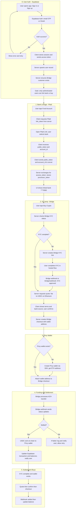

# BlendFi User Flow

```mermaid
flowchart TB

subgraph S0["0. User Auth - Supabase"]
  A1[User opens app: Sign in or Sign up]
  A2["Supabase Auth: email OTP or OAuth"]
  A3{Auth success?}
  A4[Show error and retry]
  A5[Client stores session and sends access token]
  A6[Server upserts user record]
  A7[Server ensures Bridge customer exists]
  A8[Gate: only authenticated users can link bank or buy]
end
A1 --> A2 --> A3
A3 -- No --> A4 --> A1
A3 -- Yes --> A5 --> A6 --> A7 --> A8

subgraph S1["1. Bank Linkage - Plaid"]
  B1[User taps Fund Account]
  B2[Client requests Plaid link_token from server]
  B3[Open Plaid Link; user selects bank]
  B4[Client receives public_token and account_id]
  B5[Client sends public_token and account_id to server]
  B6[Server exchanges for access_token; stores processor_token]
  B7[UI shows linked bank ****0583]
end
A8 --> S1
B1 --> B2 --> B3 --> B4 --> B5 --> B6 --> B7

subgraph S2["2. On-ramp - Bridge"]
  C1[User taps Buy Crypto]
  C2[Server checks Bridge KYC status]
  C3{KYC complete?}
  C4[Server creates Bridge KYC link]
  C5[User completes KYC in hosted flow]
  C6[Bridge webhook to /bridge/webhook: KYC approved]
  C7[Server requests quote: fiat to USDC on Ethereum]
  C8[Client shows terms and bank source; user confirms]
  C9[Server creates Bridge checkout with wallet address]
end
B7 --> C1 --> C2 --> C3
C3 -- No --> C4 --> C5 --> C6 --> C7
C3 -- Yes --> C7
C7 --> C8 --> C9

subgraph S3["3. Privy Wallet"]
  D1{Privy wallet exists?}
  D2[Create Privy wallet via SDK; get ETH address]
  D3[Attach wallet address to Bridge checkout]
end
C9 --> D1
D1 -- No --> D2 --> D3
D1 -- Yes --> D3

subgraph S4["4. Funding and Settlement"]
  E1[Bridge processes ACH transfer]
  E2[Bridge webhook sends status updates]
  E3{Settled?}
  E4[USDC sent on-chain to Privy wallet]
  E5[Update Supabase: transaction and balances; notify user]
  E6[If failed: log and notify user; allow retry]
end
D3 --> E1 --> E2 --> E3
E3 -- Yes --> E4 --> E5
E3 -- No --> E6

subgraph S5["5. Subsequent Buys"]
  F1[KYC complete and wallet exists]
  F2[Quote then confirm then checkout]
  F3[Webhook settled then update balance]
end
E5 --> F1 --> F2 --> F3
```